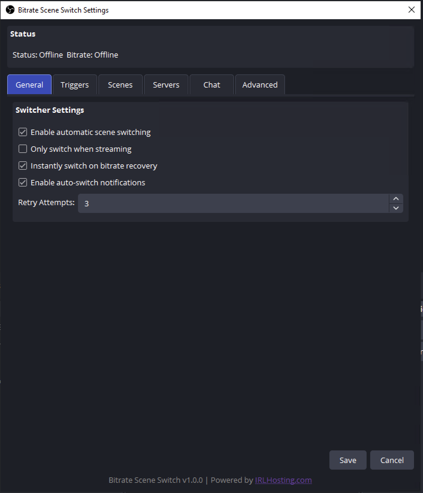
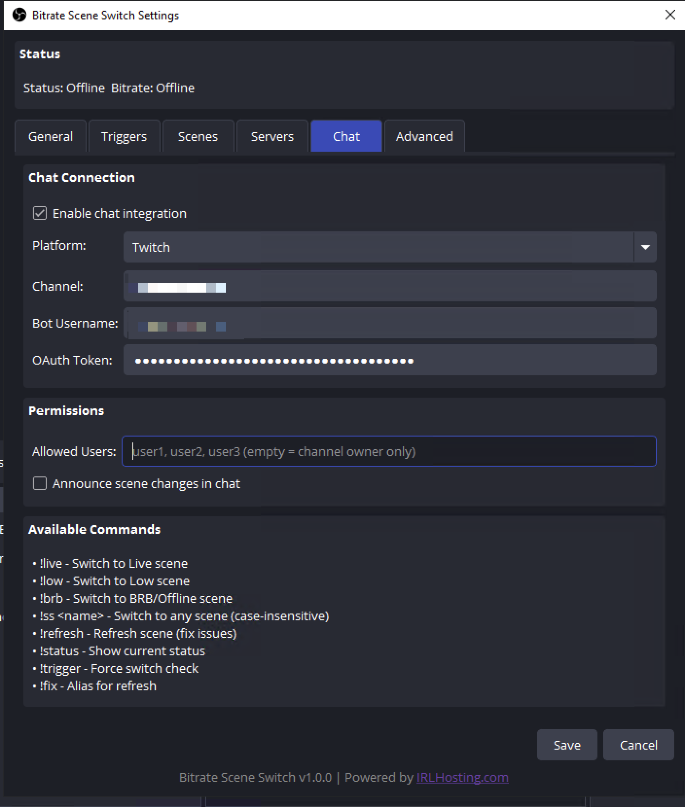
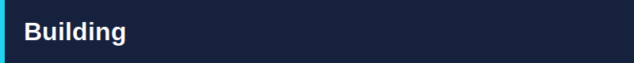

<p align="center">
  
</p>

<p align="center">
  <a href="https://github.com/sniffingpickles/BitrateSceneSwitch/releases"></a>
  <a href="https://github.com/sniffingpickles/BitrateSceneSwitch/actions"></a>
  <a href="https://github.com/sniffingpickles/BitrateSceneSwitch/blob/main/LICENSE"></a>
</p>

<p align="center">
  <i>This plugin was heavily inspired by <a href="https://github.com/NOALBS/nginx-obs-automatic-low-bitrate-switching">NOALBS</a>. Huge thanks to the NOALBS team for their amazing work!</i>
</p>

---


- **Automatic Scene Switching** - Switch scenes based on bitrate thresholds
- **Multiple Server Support** - Works with BELABOX, NGINX, SLS, MediaMTX, and more
- **RTT Monitoring** - SRT round-trip-time based switching
- **Twitch Chat Integration** - Control scenes via chat commands
- **Configurable Triggers** - Set low bitrate, offline, and RTT thresholds
- **Optional Scenes** - Starting, ending, privacy, and refresh scenes

---


<p align="center">
  
  
</p>

---


### Windows

1. Download the latest release from [**Releases**](https://github.com/sniffingpickles/BitrateSceneSwitch/releases)
2. Extract the zip file
3. Copy contents to your OBS installation:
   - `BitrateSceneSwitch.dll` → `C:\Program Files\obs-studio\obs-plugins\64bit\`
4. Restart OBS Studio

---


1. Open OBS Studio
2. Go to **Tools** → **Bitrate Scene Switch**
3. Configure your stream server and thresholds
4. Select your scenes and click **Save**

---


Control the switcher via Twitch chat (requires setup in Chat tab):

| Command | Description |
|---------|-------------|
| `!live` | Switch to Live scene |
| `!low` | Switch to Low scene |
| `!brb` | Switch to BRB/Offline scene |
| `!ss <name>` | Switch to any scene (case-insensitive) |
| `!refresh` | Refresh scene (fix issues) |
| `!fix` | Refresh media sources |
| `!status` | Show current bitrate status |
| `!trigger` | Force switch check |
| `!start` | Start streaming |
| `!stop` | Stop streaming |

---


BitrateSceneSwitch registers as an **obs-websocket vendor**, allowing external tools, bots, and overlays to control the plugin remotely. Requires [obs-websocket](https://github.com/obsproject/obs-websocket) (included with OBS 28+).

All requests use the vendor name `BitrateSceneSwitch` and are sent via the obs-websocket `CallVendorRequest` message.

### Requests

| Request | Description | Parameters | Response |
|---------|-------------|------------|----------|
| `GetSettings` | Get all plugin settings | _none_ | `enabled`, `onlyWhenStreaming`, `instantRecover`, `retryAttempts`, triggers, scenes |
| `SetSettings` | Update plugin settings (partial updates supported) | Any settings field (e.g. `enabled`, `triggerLow`, `sceneNormal`) | `success: true` |
| `GetStatus` | Get live status | _none_ | `currentScene`, `isStreaming`, `bitrateKbps`, `rttMs`, `isOnline`, `serverName`, `statusMessage`, `enabled` |
| `SwitchScene` | Switch to a specific scene | `sceneName` (string, required) | `success: true/false`, `error` if failed |
| `StartStream` | Start streaming | _none_ | `success: true/false`, `error` if already streaming |
| `StopStream` | Stop streaming | _none_ | `success: true/false`, `error` if not streaming |
| `GetVersion` | Get plugin version | _none_ | `version`, `vendor` |

### Example (obs-websocket JSON)

```json
{
  "op": 6,
  "d": {
    "requestType": "CallVendorRequest",
    "requestId": "1",
    "requestData": {
      "vendorName": "BitrateSceneSwitch",
      "requestType": "GetStatus"
    }
  }
}
```

### Example (obs-websocket-js)

```js
const resp = await obs.callVendorRequest("BitrateSceneSwitch", "GetStatus", {});
console.log(resp.bitrateKbps, resp.rttMs, resp.currentScene);
```

---


| Server | Stats URL Example |
|--------|-------------------|
| **BELABOX** | `https://cloud.belabox.net/stats` |
| **NGINX RTMP** | `http://localhost:8080/stat` |
| **SRT Live Server** | `http://localhost:8181/stats` |
| **MediaMTX** | `http://localhost:9997/v3/paths/get/` |
| **Node Media Server** | `http://localhost:8000/api/streams` |
| **Nimble** | `http://localhost:8082` |
| **IRLHosting** | Your server stats URL |

---



```bash
cmake -B build -S .
cmake --build build --config Release
```

---


GPL-2.0

---

<p align="center">
  <sub>v1.0.3 | Powered by <a href="https://irlhosting.com"><b>IRL</b><span style="color: #22d3ee;">Hosting</span></a></sub>
</p>
