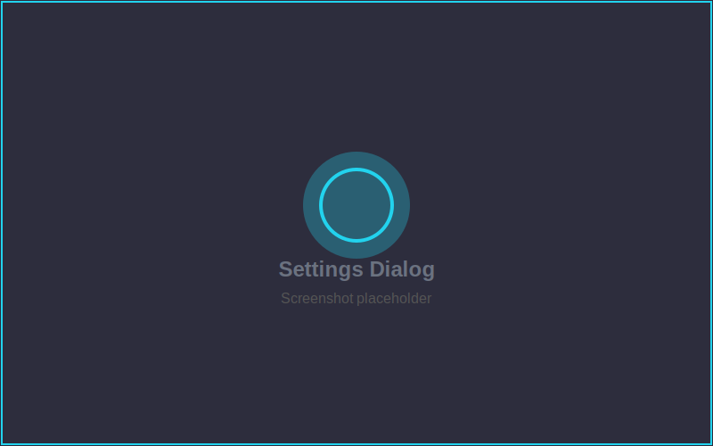
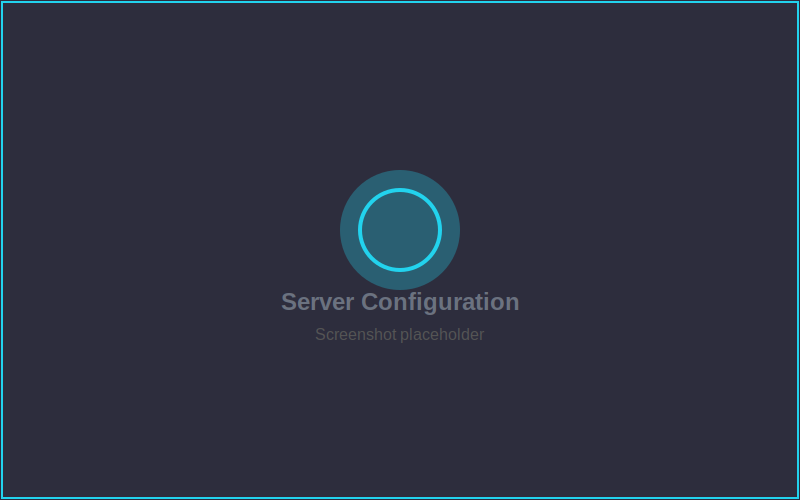

<p align="center">
  
</p>

<p align="center">
  <a href="https://github.com/sniffingpickles/BitrateSceneSwitch/releases"></a>
  <a href="https://github.com/sniffingpickles/BitrateSceneSwitch/actions"></a>
  <a href="https://github.com/sniffingpickles/BitrateSceneSwitch/blob/main/LICENSE"></a>
</p>

---

## Features

- **Automatic Scene Switching** - Switch scenes based on bitrate thresholds
- **Multiple Server Support** - Works with BELABOX, NGINX, SLS, MediaMTX, and more
- **RTT Monitoring** - SRT round-trip-time based switching
- **Twitch Chat Integration** - Control scenes via chat commands
- **Configurable Triggers** - Set low bitrate, offline, and RTT thresholds
- **Optional Scenes** - Starting, ending, privacy, and refresh scenes

---

## Screenshots

<p align="center">
  
</p>

<p align="center">
  
</p>

---

## Installation

### Windows

1. Download the latest release from [**Releases**](https://github.com/sniffingpickles/BitrateSceneSwitch/releases)
2. Extract the zip file
3. Copy contents to your OBS installation:
   - `BitrateSceneSwitch.dll` → `C:\Program Files\obs-studio\obs-plugins\64bit\`
4. Restart OBS Studio

---

## Usage

1. Open OBS Studio
2. Go to **Tools** → **Bitrate Scene Switch**
3. Configure your stream server and thresholds
4. Select your scenes and click **Save**

---

## Chat Commands

Control the switcher via Twitch chat (requires setup in Chat tab):

| Command | Description |
|---------|-------------|
| `!live` | Switch to Live scene |
| `!low` | Switch to Low scene |
| `!brb` | Switch to BRB/Offline scene |
| `!ss <name>` | Switch to any scene (case-insensitive) |
| `!refresh` | Refresh scene (fix issues) |
| `!status` | Show current bitrate status |
| `!trigger` | Force switch check |

---

## Supported Servers

| Server | Stats URL Example |
|--------|-------------------|
| **BELABOX** | `https://cloud.belabox.net/stats` |
| **NGINX RTMP** | `http://localhost:8080/stat` |
| **SRT Live Server** | `http://localhost:8181/stats` |
| **MediaMTX** | `http://localhost:9997/v3/paths/get/` |
| **Node Media Server** | `http://localhost:8000/api/streams` |
| **Nimble** | `http://localhost:8082` |
| **IRLHosting** | Your server stats URL |

---

## Building

```bash
cmake -B build -S .
cmake --build build --config Release
```

---

## License

GPL-2.0

---

<p align="center">
  <sub>v1.0.0 | Powered by <a href="https://irlhosting.com"><b>IRL</b><span style="color: #22d3ee;">Hosting</span></a></sub>
</p>
