<p align="center">
  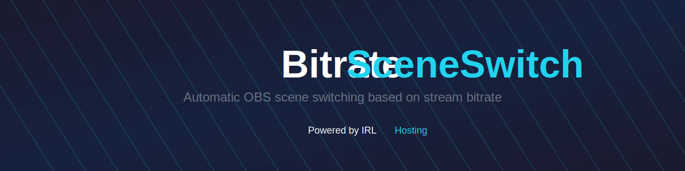
</p>

<p align="center">
  <a href="https://github.com/sniffingpickles/BitrateSceneSwitch/releases"></a>
  <a href="https://github.com/sniffingpickles/BitrateSceneSwitch/actions"></a>
  <a href="https://github.com/sniffingpickles/BitrateSceneSwitch/blob/main/LICENSE"></a>
</p>

<p align="center">
  <i>Inspired by <a href="https://github.com/NOALBS/nginx-obs-automatic-low-bitrate-switching">NOALBS</a>. Big thanks to that crew for paving the road.</i>
</p>

---


- **Auto scene switching** based on bitrate and SRT RTT
- **Multiple stream servers** with priority and fail-over
- **Twitch and Kick chat** commands with fuzzy scene matching
- **End stream on raid** for Twitch and Kick
- **Custom command names** and chat message templates
- **obs-websocket vendor API** for bots, decks, and overlays
- **RIST stale-frame fix** to clear the frozen last frame
- Optional starting / ending / privacy / refresh scenes

---


<table>
  <tr>
    <td>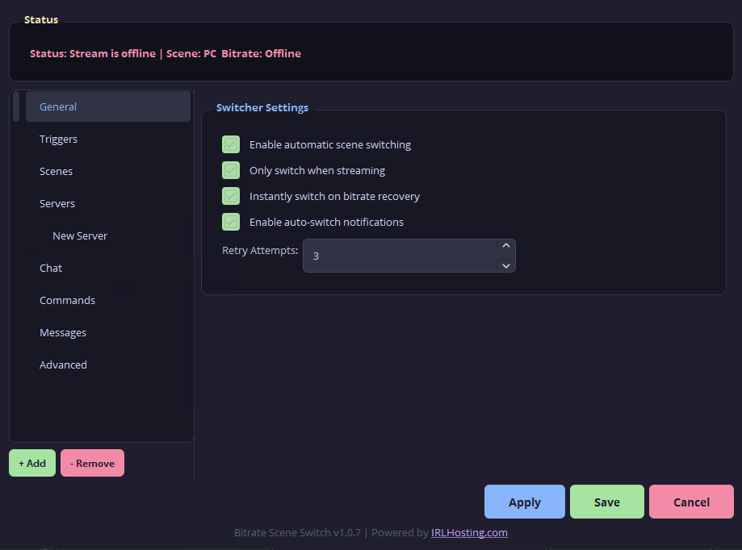</td>
    <td>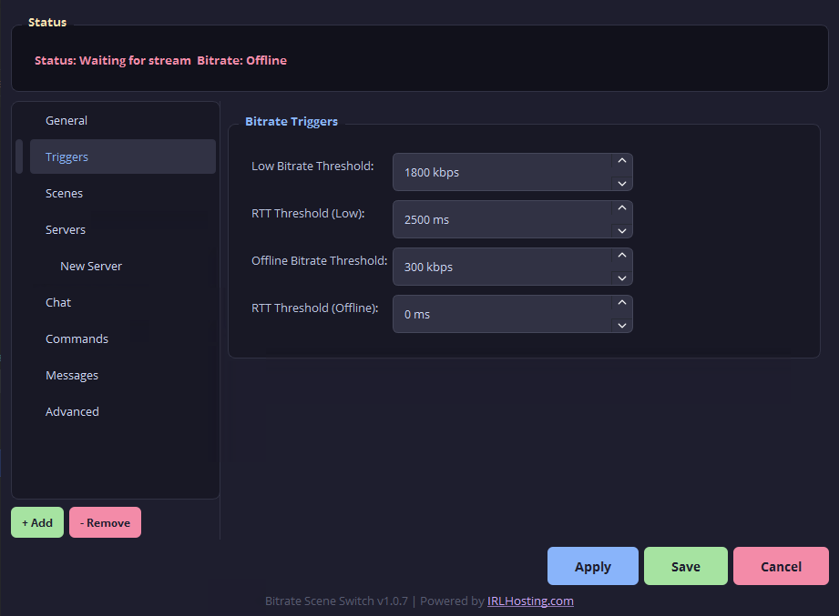</td>
    <td>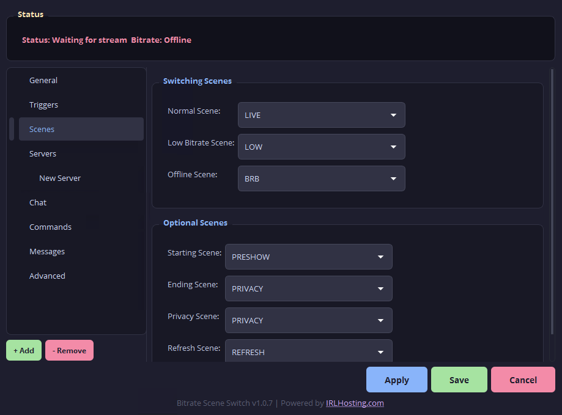</td>
  </tr>
  <tr>
    <td>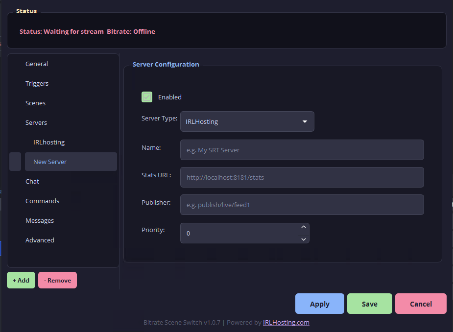</td>
    <td>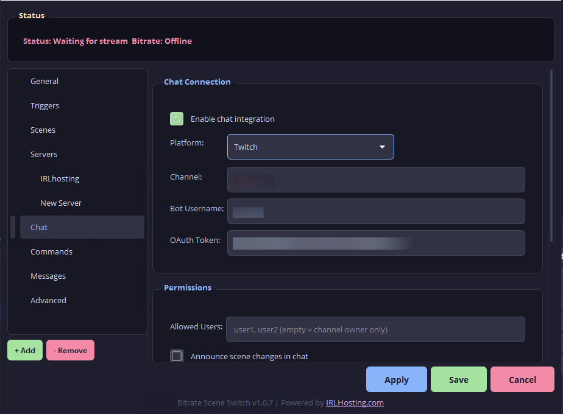</td>
    <td>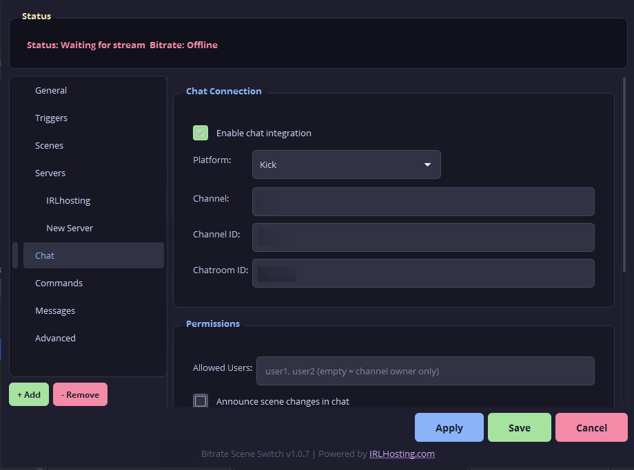</td>
  </tr>
  <tr>
    <td>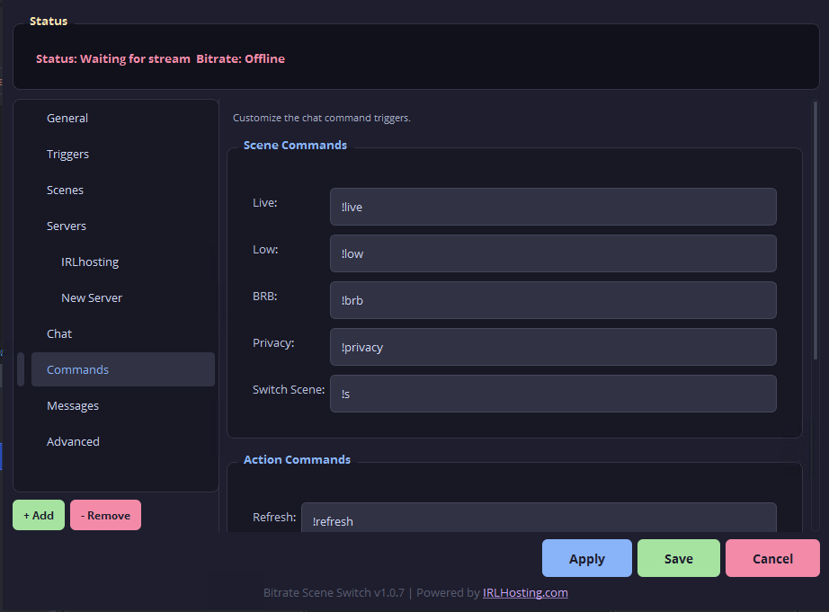</td>
    <td>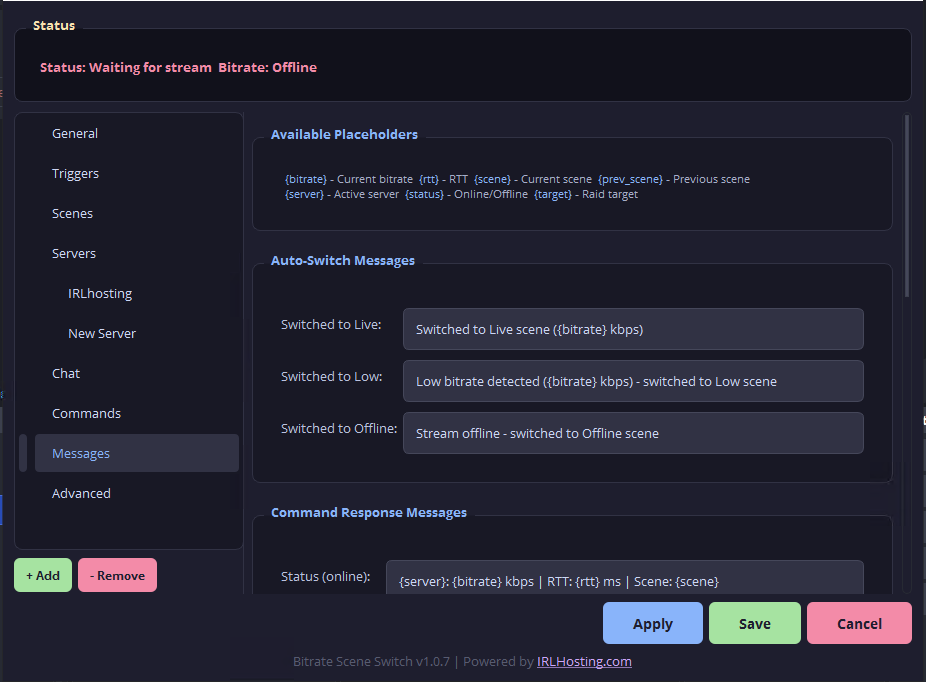</td>
    <td>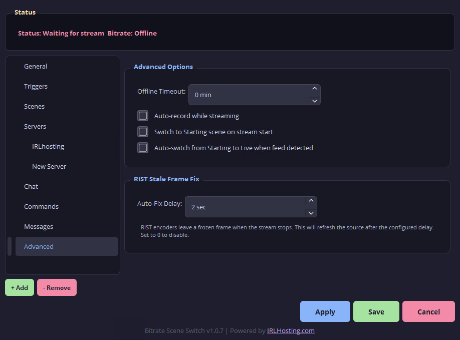</td>
  </tr>
</table>

---


1. Grab the latest build from [**Releases**](https://github.com/sniffingpickles/BitrateSceneSwitch/releases)
2. Extract the zip
3. Drop `BitrateSceneSwitch.dll` into `C:\Program Files\obs-studio\obs-plugins\64bit\`
4. Restart OBS

> Windows x64 and Windows ARM64 builds are published per release.

---


1. **Tools → Bitrate Scene Switch**
2. Add your stream server on the **Servers** tab (IRLhosting, BELABOX, NGINX, SRT, RIST, etc.)
3. Pick your **Live / Low / Offline** scenes on the **Scenes** tab
4. Tune your bitrate and RTT thresholds on the **Triggers** tab
5. Hit **Save**

The status bar at the top of the dialog shows live bitrate, RTT, and the active scene so you can verify it's wired up before going live.

---


Works with **Twitch** and **Kick** chat. By default, only the broadcaster can use commands; add other allowed users on the Chat tab. Every command name can be renamed under the **Commands** tab.

| Command | What it does |
|---------|--------------|
| `!live` | Switch to your Live scene |
| `!low`  | Switch to your Low scene |
| `!brb`  | Switch to your BRB / Offline scene |
| `!privacy` | Switch to your Privacy scene |
| `!ss <name>` | Switch to any scene by name. Fuzzy match, so `!ss priv` will hit `PRIVACY` |
| `!s <name>` | Same as `!ss`, shorter alias |
| `!refresh` | Re-trigger the current scene (clears stuck sources) |
| `!fix` | Refresh media sources (RTMP, SRT, RIST, etc.) |
| `!status` | Reply with current bitrate, RTT, and scene |
| `!trigger` | Force a switch check immediately |
| `!start` | Start streaming |
| `!stop`  | Stop streaming |

---


### End stream on raid

When you raid out (Twitch raid or Kick host), the plugin can stop the stream automatically so you don't keep encoding into a dead chat. Toggle it on the **Chat** tab.

- **Twitch**: listens via PubSub for `raid.<your_user_id>` and reacts to both the timer running out and the "Raid Now" button.
- **Kick**: listens to the chatroom Pusher channel for `ChatMoveToSupportedChannelEvent`.
- Optional chat announcement before the stream stops (Twitch only).

---


BitrateSceneSwitch registers as an **obs-websocket vendor**, so bots, Stream Decks, and overlays can drive the plugin remotely. Requires [obs-websocket](https://github.com/obsproject/obs-websocket) (bundled with OBS 28+).

All requests use vendor name `BitrateSceneSwitch` via the obs-websocket `CallVendorRequest` op.

### Requests

| Request | Description | Parameters | Response |
|---------|-------------|------------|----------|
| `GetSettings` | Get all plugin settings | _none_ | `enabled`, `onlyWhenStreaming`, `instantRecover`, `retryAttempts`, triggers, scenes |
| `SetSettings` | Update settings (partial updates supported) | Any settings field (e.g. `enabled`, `triggerLow`, `sceneNormal`) | `success: true` |
| `GetStatus` | Live status | _none_ | `currentScene`, `isStreaming`, `bitrateKbps`, `rttMs`, `isOnline`, `serverName`, `statusMessage`, `enabled` |
| `SwitchScene` | Switch to a specific scene | `sceneName` (string, required) | `success`, `error` if failed |
| `StartStream` | Start streaming | _none_ | `success`, `error` if already streaming |
| `StopStream` | Stop streaming | _none_ | `success`, `error` if not streaming |
| `GetVersion` | Plugin version | _none_ | `version`, `vendor` |

### Example (raw obs-websocket JSON)

```json
{
  "op": 6,
  "d": {
    "requestType": "CallVendorRequest",
    "requestId": "1",
    "requestData": {
      "vendorName": "BitrateSceneSwitch",
      "requestType": "GetStatus"
    }
  }
}
```

### Example (obs-websocket-js)

```js
const resp = await obs.callVendorRequest("BitrateSceneSwitch", "GetStatus", {});
console.log(resp.bitrateKbps, resp.rttMs, resp.currentScene);
```

---


Add as many servers as you want on the **Servers** tab. Each one has its own priority; the plugin uses the highest-priority server that's reporting bytes.

| Server | Stats URL Example |
|--------|-------------------|
| **BELABOX** | `https://cloud.belabox.net/stats` |
| **NGINX RTMP** | `http://localhost:8080/stat` |
| **[Moo RIST](https://github.com/moo-the-cow/moo-rist-hosting-native)** | `http://localhost:8080/stats` |
| **SRT Live Server** | `http://localhost:8181/stats` |
| **MediaMTX** | `http://localhost:9997/v3/paths/get/` |
| **Node Media Server** | `http://localhost:8000/api/streams` |
| **Nimble** | `http://localhost:8082` |
| **IRLHosting** | Your server stats URL |

---

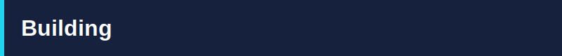

```bash
cmake -B build -S .
cmake --build build --config Release
```

CI builds on Windows x64 and Windows ARM64. macOS builds locally for development.

---


GPL-2.0

---

<p align="center">
  <sub>v1.0.8 | Powered by <a href="https://irlhosting.com"><b>IRL</b><span style="color: #22d3ee;">Hosting</span></a></sub>
</p>
